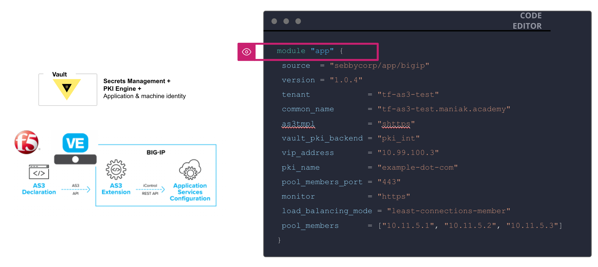

# Terraform F5 AS3 Module with Vault PKI Engine

The following module allows you to deploy a secure F5 HTTPS vip in your environment with Vault as the PKI Engine.



## How to use the module.. 
Example of using the module

module "app1" {
  source  = "sebbycorp/app/bigip"
  version = "1.0.4"
  tenant            = "tf-as3-test"
  common_name       = "tf-as3-test.maniak.academy"
  as3tmpl           = "shttps"
  vault_pki_backend = "pki_int"
  vip_address       = "10.99.100.3"
  pki_name          = "example-dot-com"
  pool_members_port = "443"
  monitor           = "https"
  load_balancing_mode = "least-connections-member"
  pool_members      = ["10.11.5.1", "10.11.5.2", "10.11.5.3"]
}


## Requirements
* Need vault setup with PKI Engine Enabled
* Need BIGIP deployed


### How to enable Vault PKI Engine
Here is a quick artcile to setup PKI Engine https://maniakacademy.medium.com/deploy-f5-https-vips-using-terrafrom-and-hashicorp-vault-pki-secrets-engine-6deb5075d7ba

## Setup Vault
For this we will use Vault Dev instance for easy of use

Start Vault in a new terminal

```
vault server -dev -dev-root-token-id root
```

2. Export an environment variable for the vault CLI to address the Vault server.

```
export VAULT_ADDR=http://127.0.0.1:8200
```

3. Export an environment variable for the vault CLI to authenticate with the Vault server.

```
export VAULT_TOKEN=root
```

Configure Vault
Configure PKI Engine

```
vault secrets enable pki
vault secrets tune -max-lease-ttl=87600h pki
```

2. Generate root CA and Configure CA and CRL URL


```
vault write -field=certificate pki/root/generate/internal \
     common_name="example.com" \
     ttl=87600h > CA_cert.crt# Configure the CA and CRL URL
vault write pki/config/urls \
     issuing_certificates="$VAULT_ADDR/v1/pki/ca" \
     crl_distribution_points="$VAULT_ADDR/v1/pki/crl"
```

3. Generate Intermediate CA

```
vault secrets enable -path=pki_int pki
vault secrets tune -max-lease-ttl=43800h pki_int
```

4. Execute the following command to generate an intermediate and save the CSR as pki_intermediate.csr

```
vault write -format=json pki_int/intermediate/generate/internal \
     common_name="example.com Intermediate Authority" \
     | jq -r '.data.csr' > pki_intermediate.csr
```

5. Sign the intermediate certificate with the root CA private key, and save the generated certificate as intermediate.cert.pem.

```
vault write -format=json pki/root/sign-intermediate csr=@pki_intermediate.csr \
     format=pem_bundle ttl="43800h" \
     | jq -r '.data.certificate' > intermediate.cert.pem
```

6. Once the CSR is signed and the root CA returns a certificate, it can be imported back into Vault.

```
vault write pki_int/intermediate/set-signed certificate=@intermediate.cert.pem
```

7. Create a Role named example-dot-com which allows subdomains.

```
vault write pki_int/roles/example-dot-com \
 allowed_domains=”example.com” \
 allow_subdomains=true \
 ttls="10m" \
 max_ttl=”30m”

```


Done… let’s move onto the next part.